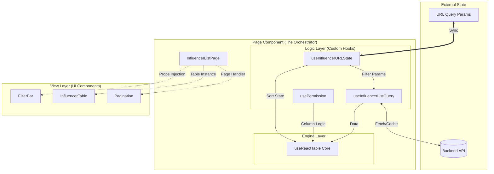

# Featuring 인플루언서 리스트 테이블 설계 문서

## 1. 요구사항 해석 및 설계 방향 요약

### 1.1 요구사항 해석

User Story를 분석해 보았을 때, Featuring의 "인플루언서 탐색 리스트"는 단순한 데이터 조회용 테이블 그 이상이라고 생각했습니다. 
마케터가 업무를 수행하는 것을 도와주는 핵심 도구로써 다음과 같은 가치를 제공해야 한다고 판단했습니다.

- **업무 연속성 확보 및 공유**: 유저가 세팅해 둔 필터 조건이 새로고침 후에도 유지되어야 하며, 동료에게 링크를 보냈을 때 똑같은 화면을 볼 수 있어야 합니다.
- **유연한 멤버십 정책**: 요금제(`Free` / `Standard` / `Premium`)에 따라 기능이 제한되거나 열려야 합니다. 추후 요금제 구조가 변경될 가능성도 열어두어야 합니다.
- **효율적인 탐색 환경 제공**: 수많은 인플루언서들 중 원하는 대상을 빠르게 찾을 수 있도록 복합적인 검색/필터/정렬 UX를 직관적으로 제공하고, 데이터가 많아져도 버벅임 없는(Performance) 쾌적한 탐색 경험을 보장해야 합니다.

### 1.2 설계 방향성

이번 설계에서는 **지속 가능한 유지보수성**과 **끊김 없는 사용자 경험(Seamless UX)**이라는 두 가지 핵심 가치를 최우선으로 고려했습니다. 즉 DX와 UX, 2가지 관점을 모두 고려하고자 했습니다.

1.  **지속 가능한 유지보수성**: 
  - 복잡한 요구사항으로 인해 코드가 비대해지고 각 레이어가 강결합 되는 것을 막기 위해, `데이터` / `로직` / `UI`가 분리된 **Headless 아키텍처**를 채택했습니다.
    
2.  **Seamless UX (끊김 없는 경험)**:
  - 사용자의 몰입을 방해하지 않기 위해 **Prefetching**(로딩 없는 페이지 전환), **Optimistic Update**(즉각적인 반응), **Skeleton UI + Suspense**(자연스러운 로딩) 등 모던 웹 환경에서 검증된 UX 패턴을 적극적으로 도입했습니다.

---

## 2. 전체 구조 설계

### 2.1 아키텍처

복잡도를 낮추기 위해 **Headless Interface** 패턴과 **Custom Hooks**를 결합한 구조로 결정했습니다. 핵심은 **페이지 컴포넌트(Page)가** 중앙에서 모든 로직을 조율하고, 비즈니스 로직은 Hook에서, UI는 각 컴포넌트가 담당하는 구조입니다.





### 2.2 계층별 상세 역할

이 구조가 실제 코드에서 어떻게 동작하는지 구체적으로 정의하면,

1. **외부 상태**:
  - 이 아키텍처의 가장 중요한 특징은 **상태가 컴포넌트 내부에 갇혀있지 않다**는 점입니다.
  - **URL**은 필터와 정렬의 상태를, **Backend DB**는 인플루언서 데이터를 가지고 있습니다. 리액트 컴포넌트는 이 외부 상태를 가져와서 보여주는 렌더러의 역할만 수행합니다.
2. **페이지 컴포넌트**:
  - `InfluencerListPage`는 직접적인 로직을 관리하지 않습니다.
  - Hook들을 호출하여 데이터를 준비하고, `useReactTable`이라는 엔진에 재료(데이터, 정렬상태 등)를 집어넣습니다.
  - 거기서 튀어나온 결과물(`table instance`)을 UI 컴포넌트에게 전달만 합니다.
3. **로직 레이어**:
  - `useInfluencerURLState`: URL의 `?sort=desc&page=2` 같은 문자열을 자바스크립트 객체 `{ sort: 'desc', page: 2 }`로 변환해주는 훅입니다.
  - `useInfluencerListQuery`: 변환된 객체를 보고 요청 조건에 맞춰 서버에 데이터를 요청하는 훅입니다.
  - `usePermission`: "이 사용자는 프리미엄 플랜이니까 엑셀 다운로드가 가능해"와 같은 유저 권한을 판단하는 훅입니다.
4. **엔진 레이어**:
  - `useReactTable`은 화면을 그리지 않고, 테이블 표시를 위해 필요한 **계산**만 담당합니다.
  - **입력**: "인플루언서 50명 데이터", "팔로워 수 내림차순 정렬", "이메일 컬럼 숨김"이라는 입력 데이터를 주면,
  - **출력**: "첫 번째 줄에는 팔로워가 가장 많은 '빠니보틀'이 와야 하고, 이메일을 뺀 [이름, 팔로워, 메모] 칸만 그려야 해"라는 식의 구체적인 **테이블 렌더링 청사진**을 만들어줍니다.
5. **뷰 레이어**:
  - 전달받은 데이터에 따른 UI 렌더링를 담당합니다.
  - `InfluencerTable` 컴포넌트는 "데이터가 어디서 왔는지", "다음 페이지가 뭔지" 알 필요가 없도록 합니다.
  - 단지 데이터에 따라 UI를 화면에 그리기만 합니다. 이렇게 데이터와 UI를 분리함으로써 UI 변경/확장에 용이한 구조가 됩니다.

### 2.3 기술 스택 및 선정 이유

| 기술 | 선정 이유 |
| :--- | :--- |
| **React + Vite** | 성숙한 개발 생태계를 갖췄기에 선택했습니다. |
| **TanStack Table** | 디자인 제약 없이 정렬, 페이징 같은 복잡한 테이블 로직만 가져다 쓰기 위해 Headless 라이브러리를 선택했습니다. |
| **TanStack Query** | 서버 데이터를 캐싱하고 프론트엔드 상태와 동기화하는 데 있어 사실상의 표준이기에 선택했습니다. |
| **TanStack Router** | URL의 Query Parameter를 type-safe 하게 다루기 위해 선택했습니다. |
| **Tailwind CSS** | 개발 생산성 증대 및 별도의 런타임 부하 없이 빠르게 스타일링을 적용할 수 있는 이점이 있어서 선택했습니다. |

---

## 3. 검색 / 필터 / 정렬 관련 설계

### 3.1 검색 설계

검색어 입력은 사용자의 가장 빈번한 인터랙션 중 하나이며, 서버 부하와 직결되는 기능입니다.

1. **Debouncing 적용**: 사용자가 검색어를 타이핑하는 도중(`a`, `ap`, `app`...)마다 API를 호출하면 서버 부하가 심해지고 사용자 경험도 끊깁니다. 입력이 0.5초(500ms) 정도 멈췄을 때만 URL을 업데이트하여 불필요한 요청을 방지합니다.
2. **페이지네이션 초기화**: 검색을 수행하면 결과 데이터의 총 개수가 달라지므로, 반드시 **현재 페이지를 1페이지로 리셋**해야 합니다. (기존에 5페이지를 보고 있었더라도, 검색 결과는 1페이지부터 보여줘야 함)
3. **URL 동기화**: 물론 검색어 또한 `?keyword=abc` 형태로 URL에 저장되어 새로고침 시 검색 쿼리가 유지되고, 검색 결과 페이지를 다른 사람에게 공유할 수 있습니다.

### <a id="filtering-strategy"></a>3.2 필터링 설계: URL Query String이 Single Source of Truth

인플루언서 탐색 시에는 "팔로워 수 범위", "카테고리 다중 선택", "성별" 등 다양한 조건이 동시에 적용됩니다. 이 복잡한 상태를 컴포넌트 내부 `useState`로만 관리하면, 새로고침 시 상태가 휘발되는 문제가 있습니다.

이를 방지하기 위해 **모든 필터 상태를 URL Query String과 동기화**하는 전략을 사용합니다.

> **구체적인 적용 예시**
> 1. 마케터가 **뷰티**와 **패션** 카테고리를 선택하고,
> 2. 팔로워 수가 **1만 명 ~ 5만 명** 사이인 인플루언서를 찾고 싶어 합니다.
> 3. 필터를 적용하는 순간 URL query parameter는 즉시 아래처럼 변해야 합니다.
>    `?category=beauty,fashion&follower_min=10000&follower_max=50000`
> 4. 이 상태에서 페이지를 새로고침해도, URL에 정보가 저장되어 있기 때문에 **동일한 필터링 결과**를 즉시 볼 수 있습니다.
> 5. 이제 마케터가 이 URL을 다른 사람과 공유하면, 그 사람도 **똑같은 필터링 결과**를 즉시 볼 수 있습니다.

#### URL Serialization 규칙 상세

복수 선택이 가능한 필터(카테고리 등)와 중복 파라미터에 대해 다음과 같은 규칙을 적용합니다.

**1. 복수 선택 표현: Comma Separated (`category=a,b`)**

- **결정**: `category=beauty,fashion` 형태를 사용합니다.
- **이유**: 표준적인 `category=beauty&category=fashion` 방식은 선택 항목이 많아질수록 URL 길이가 기하급수적으로 늘어나 가독성을 해치기 때문입니다. 물론 카테고리 키워드 자체에 `,`와 같은 특수문자를 포함하려면 별도의 escaping 처리를 해주어야 한다는 번거로움이 있지만, 현재 상태에서는 카테고리 키워드에 쉼표(`,`)가 포함될 확률이 낮으므로 안전합니다.

**2. 중복 키 처리**

- 사용자가 URL을 임의로 조작하여 중복된 키가 들어올 경우를 대비해 방어 로직을 둡니다.
- **복수 선택 필터 (카테고리)**: **Merge 전략**. `category=a,b&category=c` 처럼 들어오면 `[a, b, c]`로 모두 합쳐서 처리합니다.
- **단일 값 필터 (페이지, 정렬, 검색어 등)**: **Last Win 전략**. `page=1&page=5` 처럼 들어오면 마지막 값(`5`)을 채택하여 명확한 상태를 보장합니다.

### 3.3 데이터 정렬 설계: 정렬 기능은 서버에서 처리

결론적으로 **백엔드에서 처리하는** 방식을 선택했습니다.

> **클라이언트에서 처리하는 방식의 문제점**  
  예를 들어, 1만 명의 인플루언서 중 "내가 쓴 메모 내용 순서대로" 정렬해서 보고 싶다고 가정해 보겠습니다.
  프론트엔드에서 데이터를 정렬하는 방식이라면, 현재 페이지에서 불러온 데이터(e.g. 50명)에 대해서만 정렬할 수 있습니다. 나머지 9,950명의 순서는 알 수 없게 됩니다.
  따라서 **정확한 전체 정렬**을 제공하기 위해서는 DB 레벨에서 데이터를 조인하여 정렬한 뒤 내려주는 것이 좋습니다.

### 3.4 테이블 엔진 라이브러리 활용: 상태의 이원화 (URL vs LocalStorage)

테이블 상태라고 해서 모두 똑같은 상태가 아니기 때문에, **"공유되어야 하는 상태"**와 **"나만 보고 싶은 상태"**를 분리해서 생각해야 합니다.

1. **공유 상태 (URL)**: 필터, 정렬, 페이지네이션, 검색어
  - 새로고침 시에도 상태가 유지되어야 하고, 동료에게 링크를 줬을 때 해당 동료도 똑같은 데이터를 봐야 하기 때문입니다.
2. **개인화 상태 (`LocalStorage`)**: 컬럼 숨김 여부, 컬럼 너비
  - 이 상태가 URL에 들어가면 링크가 너무 길어지고, 동료가 내 링크를 열었을 때 동료의 컬럼 설정이 덮어씌워지는 문제가 발생합니다.
  - 따라서 이는 브라우저의 `localStorage`에 저장하여, 다음 접속 시에도 내 설정이 유지되도록 합니다.
  - **(고려 사항)** 만약 하나의 기기에서 여러 계정을 사용하는 경우를 대비한다면, LocalStorage Key에 **User ID를 Prefix로 붙여** 구분(e.g., `user_123_table_settings`)하거나, 서버 DB에 유저 설정으로 저장하는 방식을 고려할 수 있습니다.

---

## 4. 요금제 기능 제한 관련 설계

### 4.1 Feature Gating: 관련 로직을 한 곳에 모으기

코드 구석구석에 `if (plan === 'FREE')` 같은 조건문이 산재하기 시작하면 나중에 기능을 찾기도, 수정하기에도 까다롭고 DX도 떨어집니다.

- **해결책: Hook Composition**
  - `usePermission`이라는 훅(Hook) 하나에 권한 로직을 모아둡니다.
  - 컴포넌트는 어떤 UI의 렌더링 가능 여부를 직접 판단할 필요 없이, 훅에서 제공하는 `canAccess('excel_export')`와 같은 질의 함수를 통해 간단히 판단할 수 있습니다.
  - 이렇게 하면 추후 서비스 명세가 바뀌더라도, `usePermission` 파일 한 곳만 수정하면 됩니다.

---

## 5. 상태별 UX 설계

"사용자가 기다리거나 실패했을 때"의 경험이 서비스의 기능의 동작만큼이나 중요하기에, 다음과 같은 대응 전략을 수립했습니다.

### 5.1 로딩 상태 (Loading): Skeleton UI와 Suspense 활용

- **문제**: 단순한 스피너 UX를 활용하면, 데이터 로딩 이후 실제 콘텐츠가 나타날 때 레이아웃이 덜컥거리는 `Layout Shift`를 유발합니다.
- **해결 방식**: **Skeleton UI**와 **React Suspense**.
  - **기술 전략**: `React Suspense`를 활용하여 데이터 로딩 중 선언적으로 Skeleton UI를 노출합니다. 이를 통해 컴포넌트 내부에서 `isLoading` 상태를 일일이 분기 처리하는 복잡성을 제거합니다.
  - **초기 로딩**: 테이블 형태의 회색 박스(Skeleton)를 미리 보여주어, "곧 데이터가 보여진다"는 안정감을 유저에게 주고 실제 데이터를 활용해 렌더링이 이루어진 이후의 Layout Shift를 방지합니다.
  - **데이터 Refetch**: 필터를 바꿀 때는 기존 데이터를 유지하되 불투명도(`opacity`)를 낮추어 "작업 중임"을 알립니다. 새로운 데이터를 가져온 이후 화면이 갑자기 교체되는 분절적인 느낌을 최대한 줄이기 위함입니다(중간 상태 활용).

### 5.2 에러 상태: ErrorBoundary를 활용해 유저에게 에러 대응 가이드 제공

- **기술적 관점에서의 접근**: `ErrorBoundary`를 테이블 컴포넌트 상위에 배치하여, 테이블에서 에러가 발생하더라도 전체 페이지가 셧다운(White Screen)되지 않도록 격리합니다. `QueryErrorResetBoundary`와 연동하여 재시도 로직을 자연스럽게 연결합니다.
- **UX 관점에서의 접근**: "알 수 없는 오류"라는 불친절한 메시지 대신, 유저가 **스스로 해결할 수 있는 구체적인 가이드**를 제공하는 것이 좋습니다.
  - **일시적 서버/네트워크 오류**: "데이터를 불러오는 데 실패했어요" + **[다시 시도]**
  - **권한 오류**: "이 기능은 00플랜에서만 제공돼요" + **[요금제 업그레이드 알아보기]**
  - **잘못된 요청(Bad Request)**: "필터 조건이 올바르지 않아요" + **[필터 초기화]**

### 5.3 데이터 없음: 구체적인 가이드 제공

- **검색 결과 없음**: "데이터가 없습니다"라는 텍스트 하나만 띄우지 않고, "검색어 '뷰티'에 해당하는 결과가 없습니다." 문구 + **[필터 초기화]** 버튼 제공으로 다음 행동을 자연스럽게 유도합니다.

---

## 6. 상태 및 데이터 흐름 설계

### 6.1 상태 관리: URL Query String이 Single Source of Truth

[3.2 필터링 설계](#filtering-strategy)에서 설명한 바와 같이, 사용자가 페이지에서 세팅한 필터, 검색어, 정렬 순서, 보고 있는 페이지 번호 등 **공유되어야 하는 모든 상태**는 URL Query String을 기준으로 관리하기로 결정했습니다.

- **왜 URL Query String을 사용했는가?**
  1. **새로고침 시에도 상태 유지**: 화면을 보고 있는 중에 브라우저 새로고침을 해도 내가 보던 리스트 데이터가 그대로 복원됩니다.
  2. **손쉬운 공유**: "이 조건으로 검색한 결과 좀 봐줄래?"라며 URL만 복사해서 동료에게 전달해주면 동료도 나와 완전히 같은 데이터를 바로 볼 수 있습니다.

- **데이터 흐름**
  1. 사용자가 필터를 변경하면 -> URL을 업데이트합니다 (URL 상태를 나중에 브라우저 히스토리 상에서 복원할 수 있도록 route `push` 방식을 사용).
  2. URL이 바뀌면 -> 이를 구독하던 컴포넌트가 다시 그려집니다.
  3. 동시에 Data Layer가 -> 바뀐 URL 파라미터를 들고 API를 새로 호출합니다.
  4. 호출한 API의 응답 데이터에 따라 테이블이 다시 렌더링됩니다.

### 6.2 필터 상태와 API 파라미터 매핑 전략

프론트엔드에서 다루기 편한 상태와 서버가 요구하는 파라미터의 형태가 항상 일치하지는 않습니다. 따라서 이 둘을 변환해주는 **Mapper Layer**를 두어 유연성을 확보합니다.

| 구분 | UI State (FE 내부용) | API Params (서버와의 통신용) | 변환 전략 |
| :--- | :--- | :--- | :--- |
| **범위(Range)** | `follower: [1000, 50000]` | `follower_min=1000`<br>`follower_max=50000` | 배열을 분해하여 평탄화 |
| **정렬(Sort)** | `sorting: { id: 'date', desc: true }` | `sort_by=created_at`<br>`order=desc` | 객체를 분해하고, 필드명을 DB 컬럼명으로 매핑 |
| **명명규칙** | `camelCase` (e.g. `showPaid`) | `snake_case` (e.g. `show_paid`) | 키 이름 변환 |

```typescript
// utils/paramMapper.ts 예시
const SORT_KEY_MAP: Record<string, string> = {
  'date': 'created_at',
  'follower': 'follower_count',
  // 필요한 만큼 매핑 추가
};

export const toAPIParams = (uiFilters) => {
  return {
    // 1. 범위 형태의 값을 분해하여 평탄화
    follower_min: uiFilters.followerRange?.[0], 
    follower_max: uiFilters.followerRange?.[1],
    
    // 2. 명명 규칙 변환 & 매핑
    q: uiFilters.keyword, 
    // 매핑 테이블을 보고 sort key 변환
    sort_by: SORT_KEY_MAP[uiFilters.sorting.id],
    order: uiFilters.sorting.desc ? 'desc' : 'asc'
  };
};
```
이러한 매핑 로직을 `useInfluencerListQuery` 훅 내부에서 처리하면, 컴포넌트는 UI 상태에만 집중할 수 있고 백엔드 API 스펙 변경에도 유연하게 대처할 수 있습니다.

### 6.3 커스텀 컬럼 동기화 전략: 낙관적 업데이트 (Optimistic Updates)

유저가 커스텀 컬럼의 값을 수정하고 싶어한다고 가정을 했습니다. 따라서 즉각적인 업데이트 UX를 위해서 **"서버 응답을 기다리지 않고 화면을 먼저 갱신"**하는 낙관적 업데이트 전략을 사용해야 합니다.

1.  **사용자 입력 (Enter)**: `setQueryData`를 통해 캐시된 데이터를 즉시 수정하여 화면에 반영합니다.
2.  **API 요청 (Background)**: 백그라운드에서 `PATCH` 요청을 보냅니다.
3.  **에러 발생 시 (Rollback)**: 요청이 실패하면, 요청을 보내기 직전에 캐싱해둔 이전 Snapshot 데이터로 되돌립니다. 이 때, 토스트와 같은 적절한 피드백 UX를 통해 에러 메시지를 띄워줍니다.

```typescript
// useUpdateCustomField.ts 예시
const { mutate } = useMutation({
  mutationFn: updateCustomFieldAPI,
  onMutate: async (newData) => {
    // 1. 진행 중인 Refetch 취소 (복수의 query 간 race condition 방지)
    await queryClient.cancelQueries({ queryKey: ['influencerList'] });
    // 2. 이전 상태 스냅샷 저장
    const previousData = queryClient.getQueryData(['influencerList']);
    // 3. 캐시 강제 업데이트 (화면 즉시 변경)
    queryClient.setQueryData(['influencerList'], (old) => updateLocalData(old, newData));
    return { previousData };
  },
  onError: (err, variables, context) => {
    // 4. 실패 시 롤백
    queryClient.setQueryData(['influencerList'], context.previousData);
    toast.error("저장에 실패했습니다.");
  },
  onSettled: () => {
    // 5. 최종 데이터 동기화
    queryClient.invalidateQueries({ queryKey: ['influencerList'] });
  }
});
```

### 6.4 대용량 리스트 렌더링 최적화 전략 (선택 사항)

만약 요구사항이 변경되어 테이블 페이지네이션 방식 대신 **Infinite Scrolling** 방식으로 1,000개 이상의 행을 한 번에 보여줘야 한다면, DOM 노드 개수가 급증하여(e.g. 1,000행 x 10열 = 10,000노드) 성능 저하가 발생할 수 있습니다.

- **해결책: Virtualization (Windowing)**
  - List virtualization 테크닉을 활용하여 **현재 스크롤 viewport에 보이는 행(약 20~30개)만 실제 DOM에 렌더링**합니다.
  - 스크롤 할 때마다 viewport에 보이는 영역의 데이터만 교체하는 방식으로, 데이터가 10만 개가 되어도 브라우저는 20~30개만 그리면 되므로 일정한 성능을 유지할 수 있습니다.
  - TanStack Query의 `useInfiniteQuery`와 결합하여 자연스러운 무한 스크롤 경험을 제공합니다.

---

## 7. 시각 자료 또는 코드 예시

앞서 설명한 설계들이 실제 코드로는 어떻게 표현되는지, 이해를 돕기 위해 간략한 구조를 작성해 보았습니다.

### 7.1 권한 관리 Hook (usePermission)

```tsx
// hooks/usePermission.ts
export const usePermission = () => {
  const { workspace } = useWorkspace(); // 전역 상태에서 정보를 가져옴

  // 구체적인 등급 계산 로직은 여기에 숨깁니다.
  const canAccess = (feature: 'memo' | 'save_influencer' | 'custom_col' | 'excel_download') => {
    const { plan } = workspace;

    switch (feature) {
      // Premium 전용 기능
      case 'custom_col':   
      case 'excel_download': 
        return plan === 'PREMIUM';
        
      // Standard 이상 가능 (Premium 포함)
      case 'memo':    
      case 'save_influencer':
        return plan === 'STANDARD' || plan === 'PREMIUM';
        
      default:
        return true; // 단순 조회 등은 모든 요금제 가능
    }
  };
  
  return { canAccess };
};
```

### 7.2 페이지 컴포넌트 예시
```tsx
// pages/InfluencerListPage.tsx
import { 
  useReactTable, 
  getCoreRowModel, 
  flexRender 
} from '@tanstack/react-table';
import { useLocalStorage } from './hooks/useLocalStorage'; // 가상의 훅

import { Suspense } from 'react';
import { ErrorBoundary } from 'react-error-boundary';

export default function InfluencerListPage() {
  return (
    <div className="layout">
      {/* 1. 필터 영역: 카테고리 목록 등 메타 데이터 로딩을 위한 독립적인 Suspense */}
      <ErrorBoundary fallback={<div>필터를 불러오지 못했습니다.</div>}>
        <Suspense fallback={<SkeletonFilterBar />}>
          <FilterSection />
        </Suspense>
      </ErrorBoundary>

      {/* 2. 테이블 영역: 인플루언서 리스트 데이터 로딩을 위한 독립적인 Suspense */}
      <ErrorBoundary fallback={<div>리스트를 불러오지 못했습니다.</div>}>
        <Suspense fallback={<SkeletonTable />}>
          <TableSection />
        </Suspense>
      </ErrorBoundary>
    </div>
  );
}

// 필터 컴포넌트 (서버에서 카테고리 목록 등을 가져온다고 가정)
function FilterSection() {
  const { filterParams, setFilter } = useInfluencerURLState();
  const { data: categories } = useCategoryQuery({ suspense: true }); // 카테고리 데이터 Fetch

  return <FilterBar options={categories} value={filterParams} onChange={setFilter} />;
}

// 테이블 + 페이지네이션 섹션
function TableSection() {
  // 1. 상태: URL State Hook 사용
  const { filterParams, setFilter } = useInfluencerURLState(); 
  
  // 2. 개인화 설정: 컬럼 숨김 여부는 로컬 스토리지에 저장하되, 유저별로 격리합니다.
  const { userId } = useUser();
  const [columnVisibility, setColumnVisibility] = useLocalStorage(`table-col-vis-${userId}`, {}); 
  
  // 3. 데이터 Fetch (Suspense Enabled)
  const { data } = useInfluencerListQuery(filterParams, { suspense: true });
    
  // 4. 권한 체크
  const { canAccess } = usePermission();
  
  // 5. Table Engine 설정
  const table = useReactTable({
    data: data?.items ?? [],
    columns: getColumns({ showCustom: canAccess('custom_col') }), 
    pageCount: data?.totalPages ?? -1, 
    manualPagination: true,           
    manualSorting: true,              
    getCoreRowModel: getCoreRowModel(), 
    state: { 
      sorting: filterParams.sorting,
      pagination: filterParams.pagination,
      columnVisibility, 
    },
    onSortingChange: (updater) => setFilter(prev => ({ 
      ...prev, 
      sorting: typeof updater === 'function' ? updater(prev.sorting) : updater 
    })),
    onPaginationChange: (updater) => setFilter(prev => ({ 
      ...prev, 
      pagination: typeof updater === 'function' ? updater(prev.pagination) : updater 
    })),
    onColumnVisibilityChange: setColumnVisibility, 
  });

  return (
    <>
       <InfluencerTable table={table} />
       <Pagination 
         currentPage={table.getState().pagination.pageIndex + 1}
         totalPages={table.getPageCount()}
         onPageChange={table.setPageIndex} 
       />
    </>
  );
}
```

---

## 8. UX 고도화 설계

기능 요구사항을 넘어 사용자가 "빠르고 편하다"고 느끼게 만들 수 있는 개선점들을 고려해봤습니다.

### 8.1 Data Prefetching: 로딩 딜레이를 최소화 하는 테이블 페이지 전환

- **현재**: '다음 페이지' 버튼 클릭 -> `isLoading`(스켈레톤 UI 표시) -> 데이터 노출(최소 100ms~300ms 지연 발생)
- **개선**: 사용자가 현재 페이지를 보고 있는 동안, **백그라운드에서 다음 페이지 데이터를 미리 받아옵니다.**
- **구현 방식(양자 택일)**:
  1. 현재 페이지 데이터 로드 완료 직후 `page + 1` 데이터를 미리 `queryClient.prefetchQuery`로 호출.
  2. 사용자가 '다음' 버튼에 마우스를 올리는(`onMouseEnter`) 순간 호출.
- **결과**: 버튼을 클릭하는 순간 **이미 캐싱된 데이터**가 즉시 화면에 뜨므로 로딩 대기 시간이 **0초**에 수렴합니다.

### 8.2 키보드 내비게이션: 스프레드시트 같은 UX

- **대상**: 마우스 조작을 줄이고 싶은 헤비 유저 (마케터)
- **전략**: 커스텀 컬럼 입력 시 엑셀과 유사한 키보드 경험을 제공하여 생산성을 높입니다.
  - **방향키 (↑/↓/←/→)**: 셀 포커스 이동
  - **Enter**: 편집 모드 진입 / 입력 완료 후 아래 셀로 이동
  - **Tab**: 입력 완료 후 오른쪽 셀로 이동
  - **Esc**: 편집 취소
- **구현**: `tanstack-table`은 Headless이므로 `onKeyDown` 이벤트 핸들러를 셀 컴포넌트에 붙여서 포커스 로직을 직접 구현합니다.
